# Actividad de laboratorio 5

> ## Objetivos
> * Aprender el uso del NodeMCU en proyectos de prototipado de IoT
> * Reforzar los conceptos de capa fisica vistos hasta el momento.

## Introducción

## Requisitos previos

### Software

1. Arduino IDE.
2. Fritzing.
3. Librerias de Fritzing ([Adadruit](https://learn.adafruit.com/using-the-adafruit-library-with-fritzing/import-the-library-into-fritzing), [grove](https://github.com/Seeed-Studio/fritzing_parts), [Elegoo](https://github.com/marcinwisniowski/ElegooFritzingBin) y [NodeMCU](https://github.com/AchimPieters/Fritzing-Custom-Parts/releases/tag/0.0.1)).
4. Visual Studio Code.
5. Platformio (complemento de Visual Studio code). 

### Hardware

1. NodeMCU [Documentación](https://nodemcu.readthedocs.io/en/release/)
2. Grove Base Shield for NodeMCU V1.0 [Documentación](https://wiki.seeedstudio.com/Grove_Base_Shield_for_NodeMCU_V1.0/)

## NodeMCU

### Descripción breve del sistema de desarrollo

El NodeMCU es una plataforma de código abierto con conectividad wifi basada en el SoC ESP8266 [link](https://www.espressif.com/en/products/socs/esp8266) de bajo costo. Gracias a estas caracteristicas, esta plataforma es ampliamente usada en el desarrollo de proyecyos IoT.


Las principales caracteristicas que presetnta es esta tarjeta son:
* WIFI NodeM ESP8266 + 32Mb
* Incluye USB-TTL
* 11 pines GPIO
* Cada pin GPIO puede funcionar como PWM, I2C, 1-Wire
* Contiene antena PCB.
* Pulsador RST.
* Pulsador Flash.
* Programable usando el Arduino IDE.

Para empezar a trabajar con este sistema de desarrollo es necesario tener el diagrama de pines mostrado a continuación:

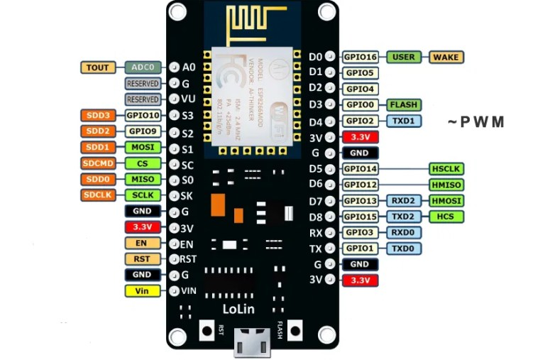

Como se puede apreciar en la figura anterior, los pines son multiproposito, es decir, se puede definir la funcionalidad al programar el dispositivo. En el enlace [NodeMCU, la popular placa de desarrollo con ESP8266](https://www.luisllamas.es/esp8266-nodemcu/) se encuentra una descripción detallada de los pines.

### Trabajando con la NodeMCU

#### Instalación de las librerias

Para trabajar con la plataforma NodeMCU, es necesario instalar las librerias del core ESP8266 para arduino ([Arduino core for ESP8266 WiFi chip](https://github.com/esp8266/Arduino)). 

Para instalar las librerias en arduino, es necesario llevar a cabo los siguientes pasos:
1. Abrir el menu en **Archivo>Preferencias**

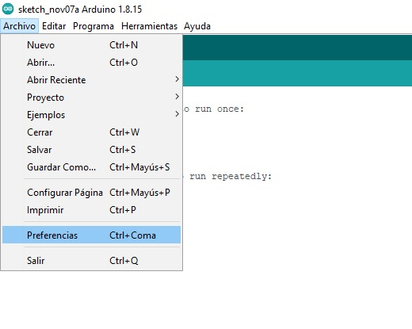

2. En el campo **Gestor de URLs Adicionales de targetas** ingresar la siguiente dirección https://arduino.esp8266.com/stable/package_esp8266com_index.json

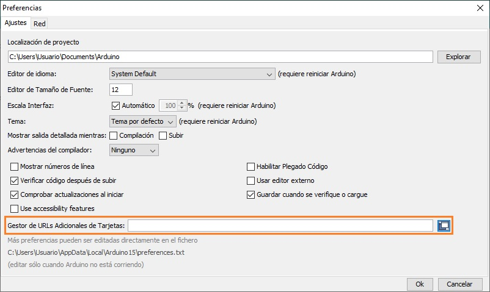

En sección **Installing the ESP8266 Arduino Addon** de la pagina [ESP8266 Thing Hookup Guide
](https://learn.sparkfun.com/tutorials/esp8266-thing-hookup-guide/all) se resume el procedimiento anteriormente descrito.

#### Agregando la targeta de desarrollo

Una vez se ha realizado el procedimiento anterior, es necesario agregar la placa de desarrollo. Para eso se siguen los siguientes pasos:

1. Acceder al Gestor de targetas tal y como se muestra en la siguiente figura:

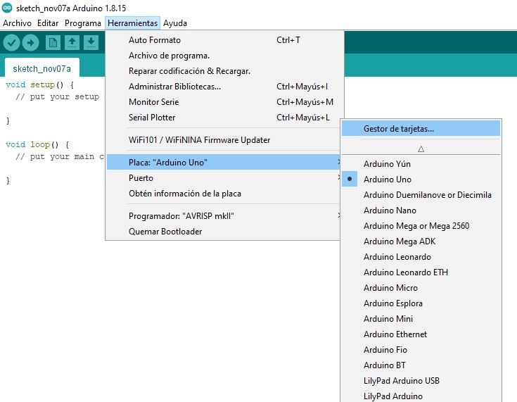

2. En la ventana del gestor de targetas colocar **ESP8266** y dar click en el botón **instalar**

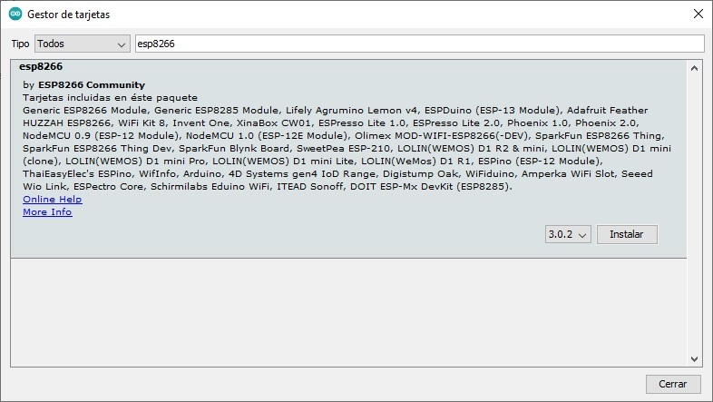

Si el anterior procedimiento se hace sin contratiempos, el siguiente paso es realizar una prueba sencilla de programación en la nueva placa.

#### Realizando la primera prueba

Una vez que se ha realizado la instalación de las librerias necesarias, conviene hacer una prueba inicial para verificar el correcto funcionamiento del IDE para esta nueva placa. A continuación se muestran los pasos:

1. Seleccionar la placa **NodeMCU 1.0 (ESP-12E Module)**

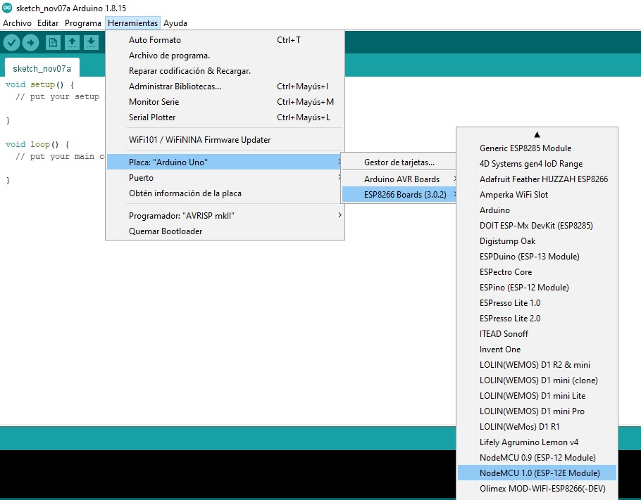

2. Configurar el puerto mediante el cual se establecera la comunicación entre el nodeMCU y el computador (En nuestro caso se eligió el puerto 4).
   
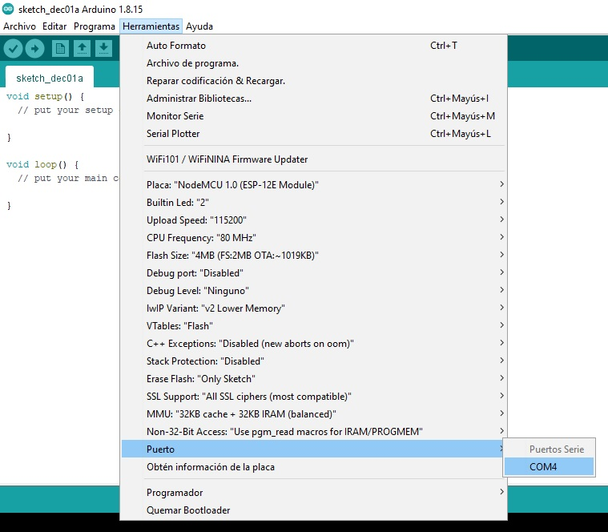

3. Notese de la figura anterior, el **Builtin Led** es el **2**. Para nuestro ejemplo vamos a códificar el siguiente ejemplo (disponible en la pagina [Cómo programar NodeMCU con el IDE de Arduino](https://programarfacil.com/esp8266/como-programar-nodemcu-ide-arduino/)) llamandolo [prueba.ino](prueba.ino):

```arduino
#define LED_BUILTIN 2

void setup() {
  // El LED integrado está conectado al pin 2.
  pinMode(LED_BUILTIN, OUTPUT);
}

void loop() {
  // Encender el LED (Está conectado con una resistencia pull-up,
  // por eso se enciende si el pin está a nivel bajo)
  digitalWrite(LED_BUILTIN, LOW);
  delay(1000); // Esperar un segundo
  // Apagar el LED
  digitalWrite(LED_BUILTIN, HIGH);
  delay(1000); // Esperar un segundo
}
```

4. Despues de codificar y guardar el codigo anterior, se procede a verificar y a descargar en la targeta, si todo sale bien, se vera algo como lo que se muestra en la siguiente figura y el led integrado a la placa NodeMCU empezará a parpadear cada uno segundo.

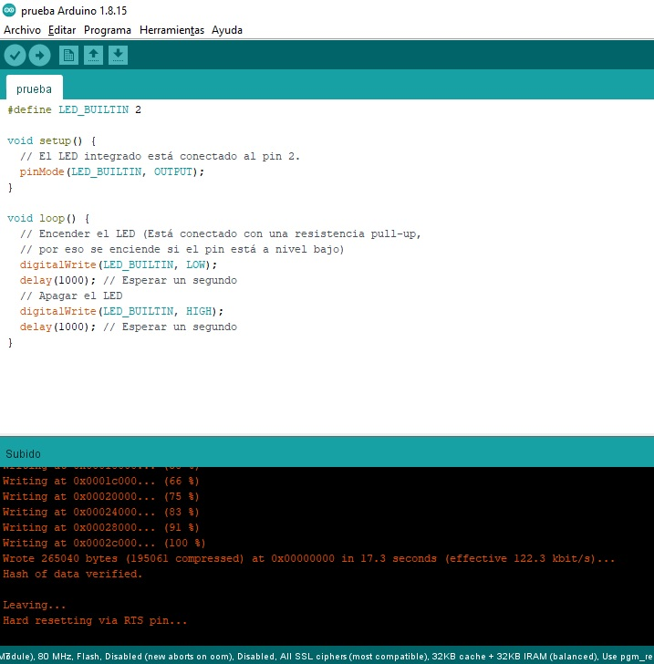

A continuación se muestra el resultado del led parpadeando:


**Actividad**: Programar y probar el ejemplo donde se controle el encendido y apagado de un led usando la la NodeMCU. El ejemplo se encuentra en [Cómo programar NodeMCU con el IDE de Arduino](https://programarfacil.com/esp8266/como-programar-nodemcu-ide-arduino/)) y la figura donde se muestra su funcionamiento se muestra a continuación:


#### NodeMCU y manejo de puertos

Reconocer como hacer la conexión del NodeMCU con cualquier despositivo electronico externo, es el primer paso para realizar cualquier proyecto de IoT que involucre este microcontrolador. Por comodidad, colocamos nuevamente el mapa de pines del NodeMCU:


Como resumen, el NodeMCU cuenta con los siguientes pines de entrada y salida: 
* 13 pines digitales numerados del D0 al D12
* 1 pin analógico numerado A0
* 3 pines de 3,3V
* 1 pin de 5V (versión V3 2 pines 5V)
* 4 pines de tierra GND (versión V3 5 pines GND)


**Pines digitales**

Tal y como se muestra en la pagina [Cómo programar NodeMCU con el IDE de Arduino](https://programarfacil.com/esp8266/como-programar-nodemcu-ide-arduino/), el nombre de los pines de NodeMCU tiene una nomenclatura diferente de la que utiliza el ESP8266. 

Por ejemplo los pines **D0**, **D1**, y **D2** en la NodeMCU correponden con **GPIO16**, **5** y **4** en el ESP8266 tal y como se muestra en la siguiente tabla tomada de wikipedia.

|IO index|ESP8266 pin|
|----|----|
|D0 |GPIO16 |
|D1	|GPIO5 |
|D2	|GPIO4 |
|D3	|GPIO0 |
|D4	|GPIO2 |
|D5	|GPIO14 |
|D6	|GPIO12 | 
|D7	|GPIO13 |
|D8	|GPIO15 |
|D9	|GPIO3 |
|D10 |GPIO1 |
|D11 |GPIO9 |
|D12 |GPIO10| |

Por ejemplo si se observa la tabla anterior,se puede notar que el Pin **D4** es equivalente al pint **GPIO4** de modo que, las siguientes dos sentencias son equivalentes:

* **Nomenclatura del NodeMCU**
  
```arduino
pinMode(D2, OUTPUT);
digitalWrite(D2, HIGH);
```

* **Nomenclatura del ESP8266**
  
```arduino
pinMode(4, OUTPUT);
digitalWrite(4, HIGH);
```

La siguiente figura muestra en detalle los pines digitales:

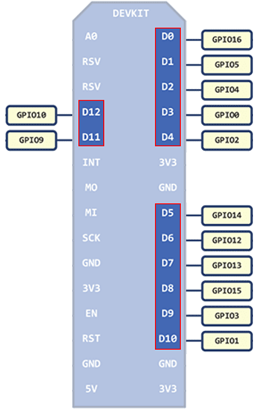

Algunos de los pines de NodeMCU no pueden ser utilizados, esto dependerá de la versión y el fabricante con el que estemos trabajando pero lo recomendable es no utilizar los pines **GPIO6**, **GPIO7**, **GPIO8**, **GPIO9** (**D11**), **GPIO10** (**D12**) y **GPIO11**. 

Tambien, se aconseja no utilizar tampoco los pines **D9** y **D10** correspondientes a la **Rx** (recepción) y a la **Tx** (transmisión). 

La siguiente figura hace enfasis en lo dicho anteriormente:

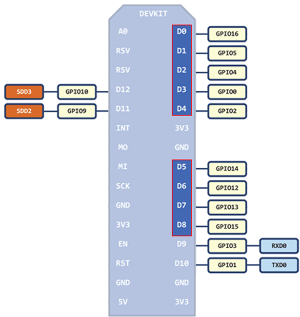

**Pines análogos**

El NodeMCU tiene solo un pin analógico (**A0**) que admite un rango de valores de 0 a 3.3V con una resolución de 10-bit.

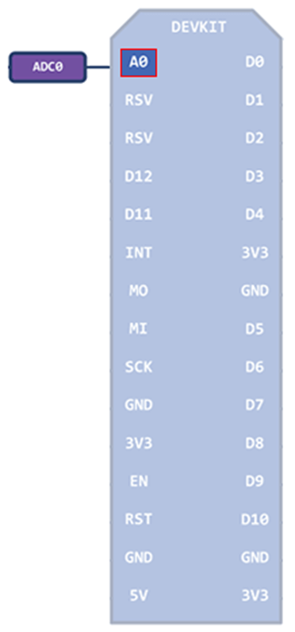


**Pines de alimentación**

Los pines de alimentación tienen 2 funciones:
* Alimentar sensores y componentes (salida).
* Alimentar la propia placa (entrada).

El voltaje de operación de NodeMCU es de 3.3V y por lo tanto, en principio no se puede alimentar ningún componente que necesite 5V. 

Sin embargo, cuando el NodeMCU se alimenta a través del puerto USB con 5V, internamente tiene un regulador de voltaje que saca 3.3V y 5V.

Los 3.3V se utilizan para alimentar el NodeMCU y saca este voltaje por los 3 pines marcados con ese valor.

Los 5V se utilizan para alimentar otros componentes dentro de la placa y se saca por el pin de 5V.

La siguiente figura detalla estos pines:

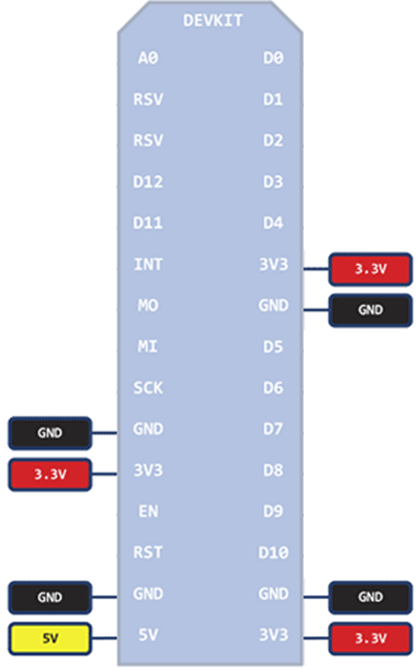


## Ejemplos

1. Poner a parpadear con un periodo de un segundo un led conectado al puerto **D5**.

**Montaje**

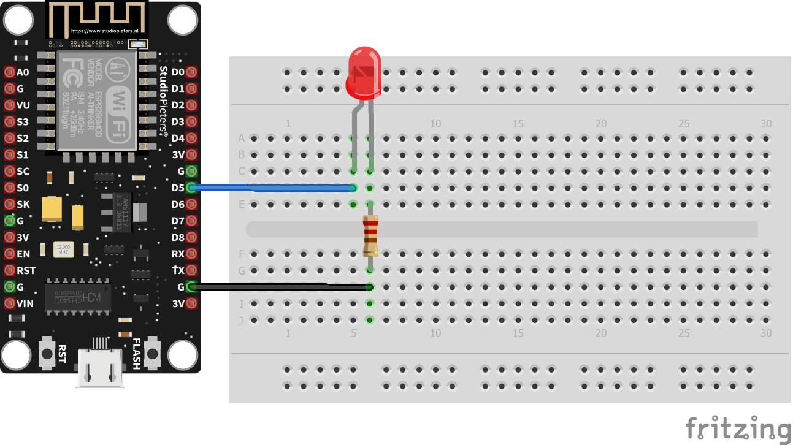

**Codigo**

```arduino
// Ejemplo tomado de: https://learn.sparkfun.com/tutorials/esp8266-thing-hookup-guide/all#powering-the-thing

#define ESP8266_LED D5 // D5 = 14

void setup() 
{
  pinMode(ESP8266_LED, OUTPUT);
}

void loop() 
{
  digitalWrite(ESP8266_LED, HIGH);
  delay(500);
  digitalWrite(ESP8266_LED, LOW);
  delay(500);
}
```

**Actividad**: Monte este ejemplo usando el shield para el NodeMCU y el led disponibles en el sistema de desarrollo de grove.

2. Hacer un programa que emplee un potenciómetro y para controlar la intensidad de un led. El programa adema, debe hacer uso del modulo Serial para enviar al monitor serial el valor leído para el potenciómetro. 

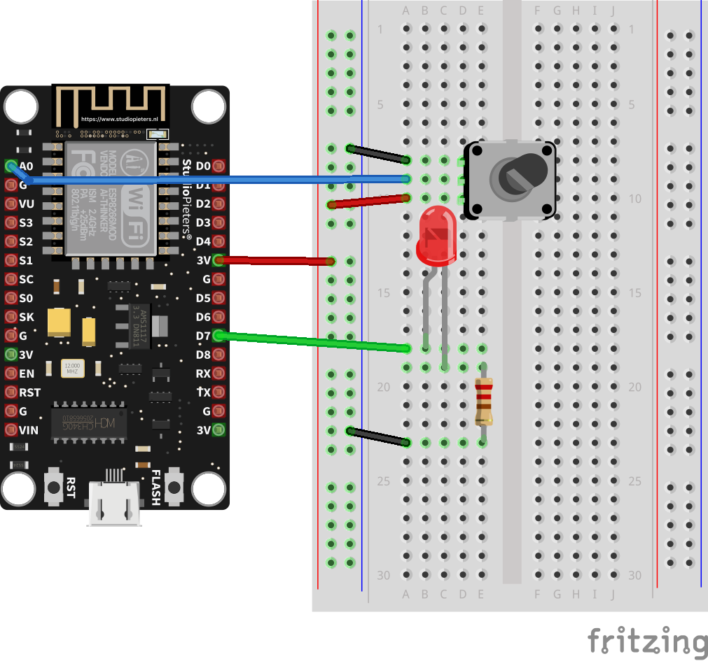

**Codigo**

```arduino
int ledPin = D7; // LED pin (D7 = GPIO17)
int Pot = A0;
int val;

void setup() {
  initPorts();
  initSerial();
}

void loop() {
  val = analogRead(Pot);
  analogWrite(ledPin, val); 
  Serial.print("Valor potenciometro: ");
  Serial.println(val);
}

/* Funciones de propias de usuario */
void initPorts() {
  pinMode(ledPin, OUTPUT);  
}

void initSerial() {
  Serial.begin(9600);
}
```

**Salida del monitor serial**

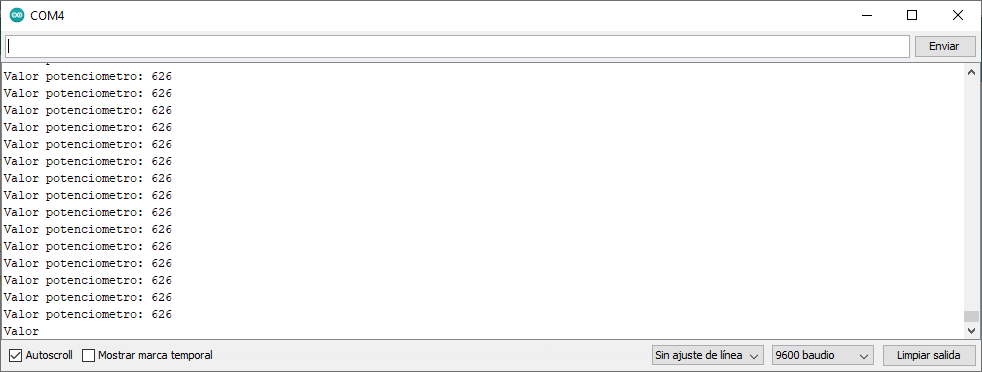

**Actividad**: Monte este ejemplo usando el shield para el NodeMCU y el led disponibles en el sistema de desarrollo de grove.

3. Realizar un ejemplo ejemplo en el cual se ponga a girar un servomotor 180° en ambos sentidos; es decir, primero este gira 180° en sentido horario, luego cuando se completa este ángulo, el sentido de giro se invierte (en sentido antihorario) y gira otra vez 180°. 

**Montaje**

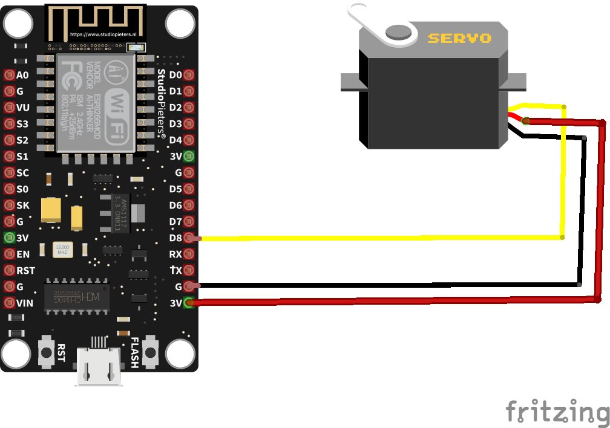

**Nota**: No se recomienda montar el circuito anterior por que el voltaje necesario para alimentar el servomotor es mayor de 3.3V. En la siguiente [pagina](https://www.engineersgarage.com/servo-motor-with-nodemcu-web-control/) se muestra una opción para hacer interfaz entre el microcontrolador y el motor de modo que este problema no se presente.

**Codigo**

```arduino
#include <Servo.h>

Servo myservo; // create servo object to control a servo

void setup(){
  myservo.attach(D8); // attach the servo on D8 = GPIO15
}

void loop(){
  int pos; // holds the position the servo should move to
  // goes from 0 degrees to 180 degrees
  // in steps of 1 degree
  for(pos = 0; pos <= 180; pos += 1){
    myservo.write(pos); // move servo to position in var pos
    delay(15); // waits 15ms to reach the position
  }
  // goes from 180 degrees to 0 degrees
  // in steps of 1 degree
  for(pos = 180; pos>=0; pos-=1) {
    myservo.write(pos); // move servo to position in var pos
    delay(15); // waits 15ms to reach the position
  }
}
```
En la siguiente [pagina](https://elosciloscopio.com/tutorial-servomotor-arduino-esp8266-y-esp32/) hay un ejemplo muy bueno relacionado con el tema.

## Para profundizar mas

En la pagina... 

## Referencias

1. https://www.esp8266.com/
2. https://readthedocs.org/projects/esp8266-arduino-spanish/downloads/pdf/latest/
3. https://esp8266-arduino-spanish.readthedocs.io/es/latest/
4. http://codigoelectronica.com/blog/esp8266-esp01-datasheet
5. https://www.espressif.com/
6. https://github.com/topics/esp32
7. https://www.aprendiendoarduino.com/category/presentacion/
8. https://www.tutorialspoint.com/esp32_for_iot/esp32_for_iot_quick_guide.htm
9. https://randomnerdtutorials.com/esp32-lora-rfm95-transceiver-arduino-ide/
10. https://www.arduino.cc/reference/en/libraries/category/communication/
11. https://www.espressif.com/en/ecosystem/iot-college/courses?field_type_tid=All&field_course_language_tid=All&page=2
12. https://www.freecodecamp.org/
13. https://programarfacil.com/esp8266/proyectos-con-esp8266-iot/
14. https://learn.sparkfun.com/tutorials/esp8266-thing-hookup-guide/all
15. https://learn.adafruit.com/adafruit-feather-huzzah-esp8266
16. https://docs.espressif.com/projects/esp-jumpstart/en/latest/introduction.html
17. https://docs.platformio.org/en/latest/platforms/espressif8266.html
18. https://randomnerdtutorials.com/vs-code-platformio-ide-esp32-esp8266-arduino/
19. https://www.luisllamas.es/esp8266-nodemcu/
20. https://programarfacil.com/podcast/como-configurar-esp01-wifi-esp8266/
21. https://programarfacil.com/podcast/proyectos-iot-con-arduino/
22. https://cdn-reichelt.de/documents/datenblatt/A300/GROVE_SYSTEM.pdf

